# Mentora

**Where teachers and students learn together.**

Teachers run classes, make quizzes and flashcards grounded in real sources,
share them with a class or a group, and watch the results arrive live.
Students join with a link, play each set one question at a time with a study
buddy cheering them on, and see their strengths and the skills to practise
next.

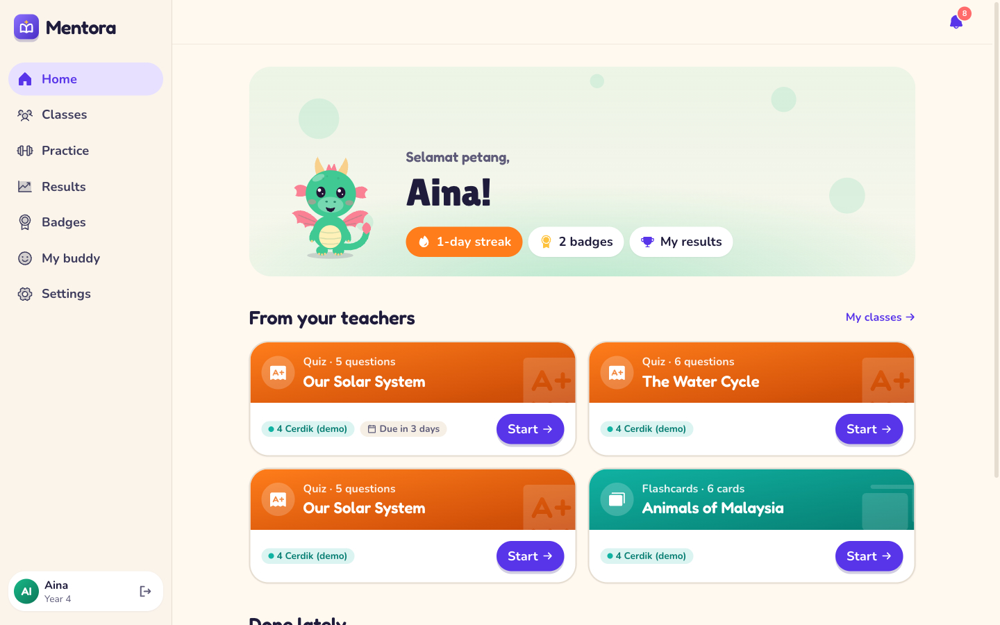

## For students

A playful, big-text view built for children: rounded display fonts, a text
size control everywhere they read, and animation that respects reduced motion.

| | |
|---|---|
| 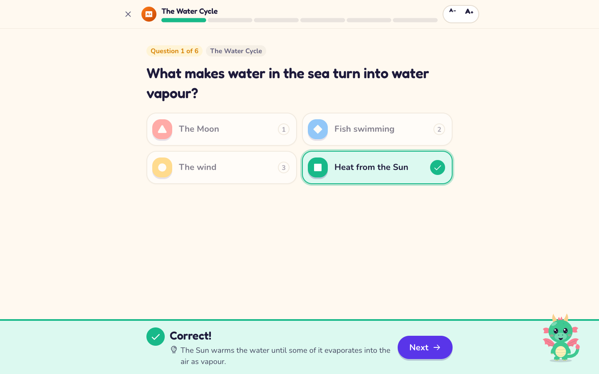 | 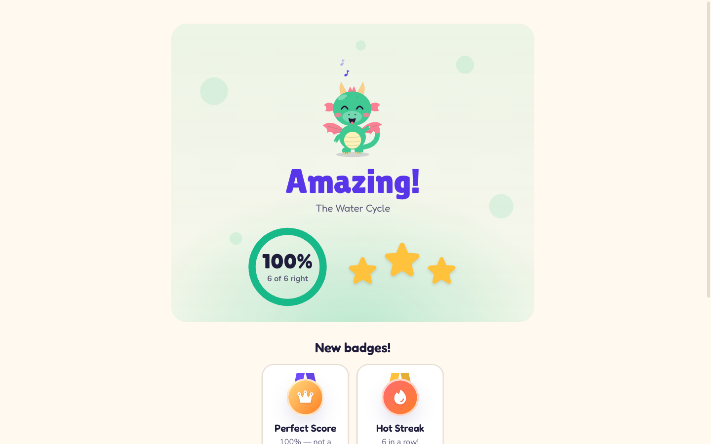 |
| **Quizzes, one question at a time.** Instant feedback with the reason, and a buddy who reacts. | **A finish worth celebrating.** Score, stars, badges earned, and how each skill went. |
| 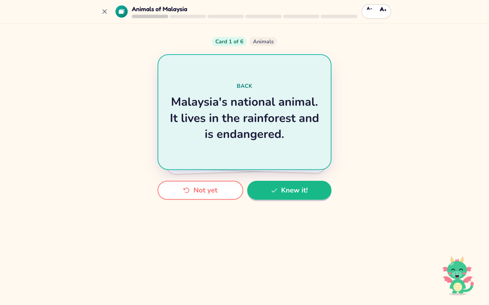 | 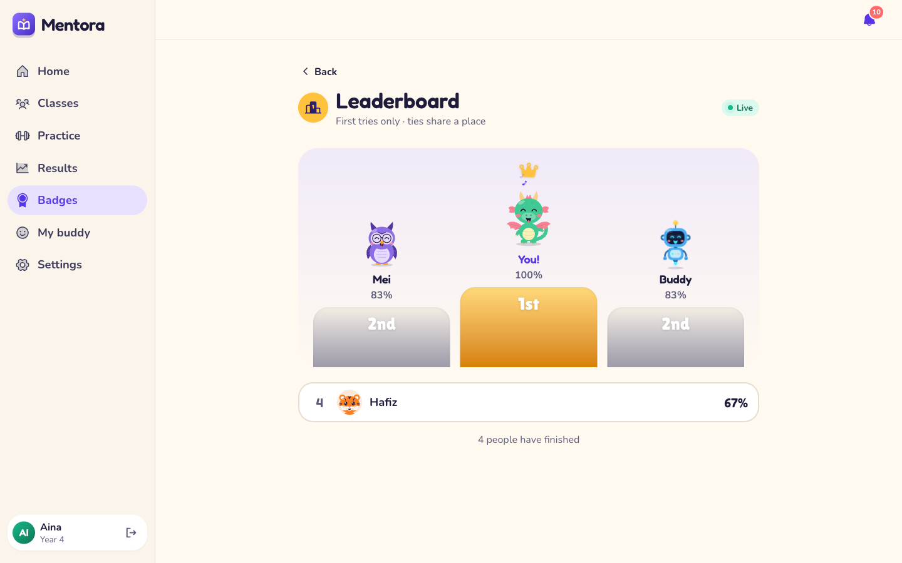 |
| **Flashcards that flip.** Cards you did not know come back for a second round. | **Live leaderboards** for every quiz — first tries only, ties share a place. |

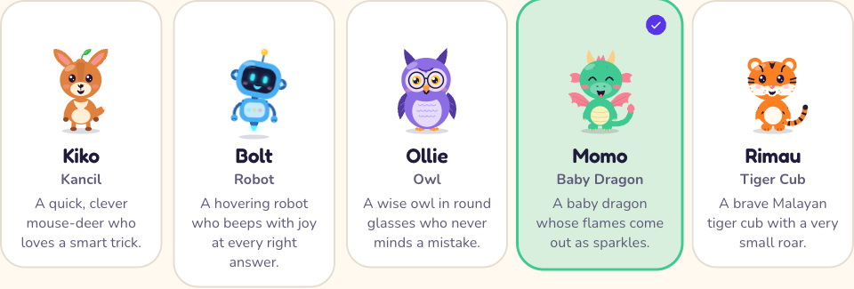

**Five study buddies** — Kiko, Bolt, Ollie, Momo and Rimau — each with their
own voice, moves and tricks. They greet, give tips, cheer right answers and
comfort wrong ones.

| | |
|---|---|
| 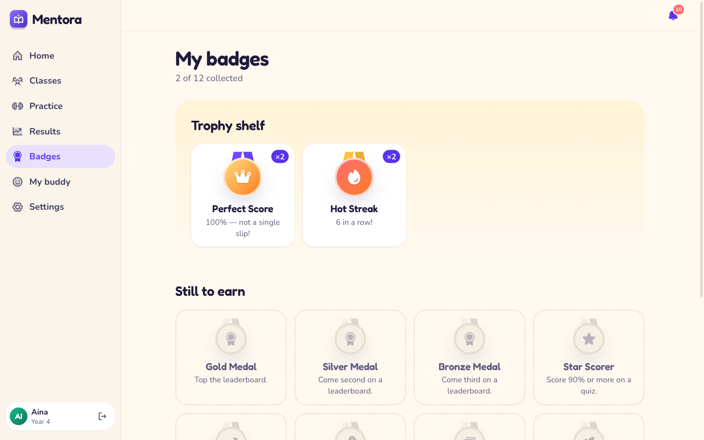 | 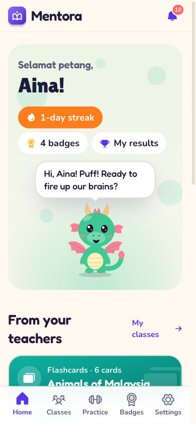 |
| **Badges** for perfect scores, streaks and leaderboard places. | **Made for phones and tablets**, where most students are. |

## Study guides

A topic taught part by part, from real sources, with a picture in every part.
Each part is written three times — **Simpler**, **Just right** and
**Challenge** — so a whole class reads the same lesson at a pace that fits
each child. Words to know open their meaning and their Malay, **Read it to me**
reads a part aloud with the sentence lighting up, and every part ends with a
quick check the teacher sees live.

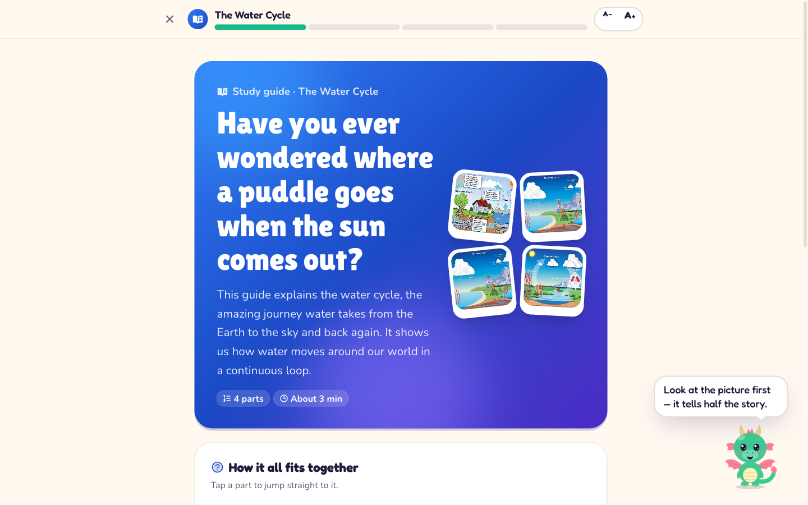

| | |
|---|---|
| 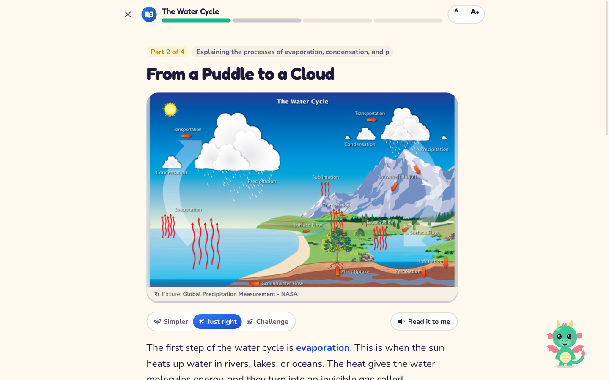 | 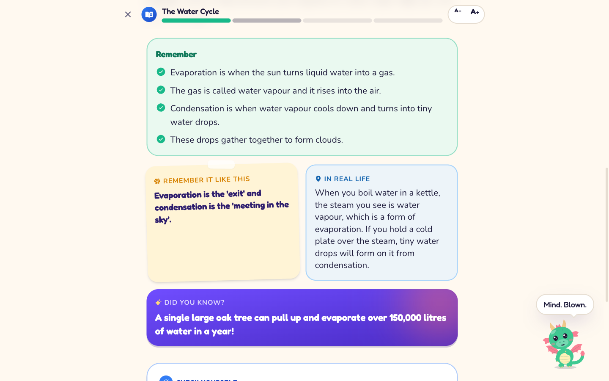 |
| **Pictures that teach** — whole diagrams, credited to their source, swappable by the teacher. | **What makes it stick** — key points, a memory trick, a Malaysian example, and a fact that makes the buddy's jaw drop. |

Teachers generate a guide in about a minute, edit any part, **rewrite a part
or add a new one with AI**, preview it as students will see it, and **print it
as a handout** with an answer key. See
[`docs/features/034-study-guides.md`](docs/features/034-study-guides.md).

## For teachers

| | |
|---|---|
| 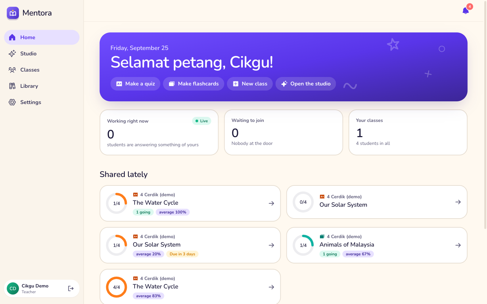 | 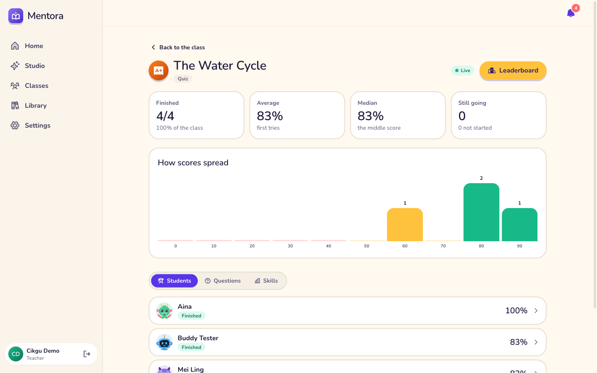 |
| **A home that shows the class at a glance** — who is answering right now, who is at the door, and how each shared set is going. | **Results as they happen.** Score spread, per-student drill-down, and which questions and skills need another look. |
| 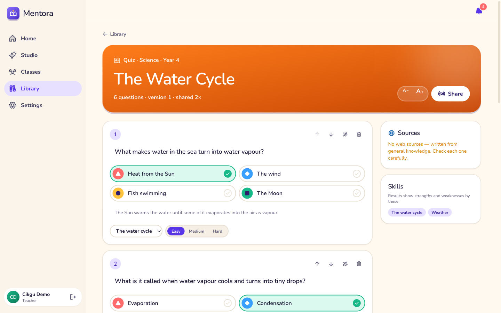 | 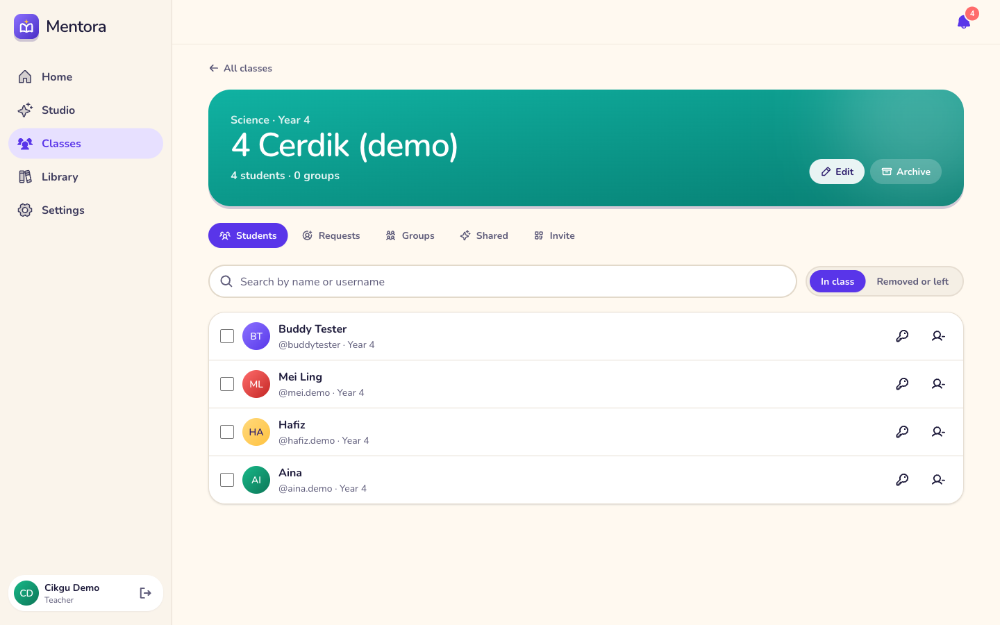 |
| **Generate, then edit.** Every question, answer, explanation, skill and difficulty is editable, and every set is versioned. | **Classes, groups and invites.** Students join with a link or a code; the teacher lets them in. |
| 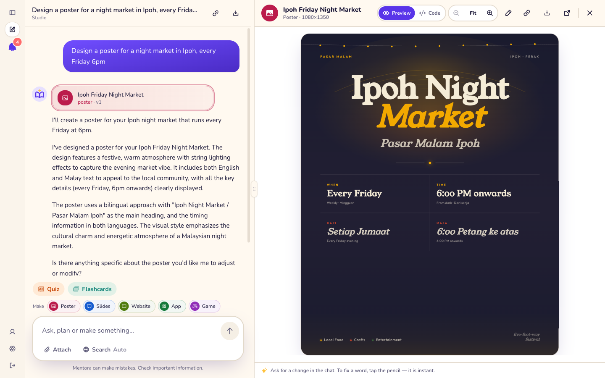 | 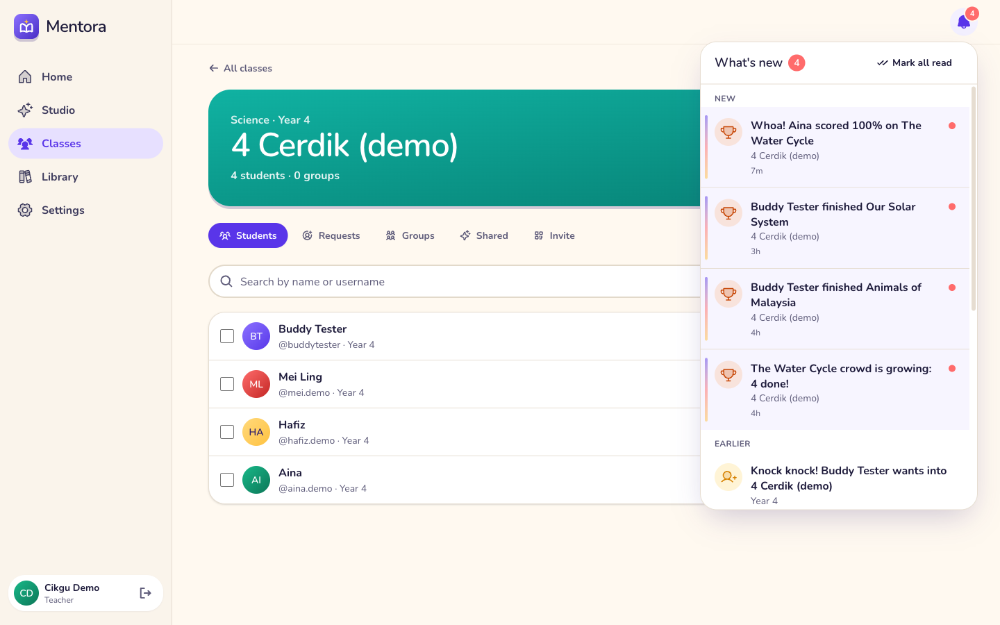 |
| **The studio** makes posters, slide decks, websites, apps and games for the classroom, with a zoomable preview. | **Live notifications** — join requests answerable in place, and news with a sense of fun. |

## Features

- **Three roles.** Admin, teacher and student, each with its own signup,
  home and permissions — decided in one policy file and enforced by the API,
  not by hiding buttons.
- **Classes and groups.** Invite links and codes, join requests, groups, and
  work shared with a whole class or one group.
- **Grounded generation.** Quizzes, flashcards and study guides are written from sources the
  app searched and read, with every answer checked against them and the
  sources shown. Malaysian Year and Form grades, in English, Malay, Tamil,
  Chinese or Bengali.
- **Study guides.** A topic taught part by part at three reading levels, with
  pictures, words to know in Malay, read-aloud, a concept map, a check after
  every part, and a printable handout.
- **Practice sets.** Students make their own private quizzes and flashcards
  on any topic, within a daily limit.
- **Results and skills.** Per-student, per-question and per-skill results,
  a score spread, and a student's own strengths and next steps.
- **Real time everywhere.** Notifications, progress while a quiz is being
  taken, leaderboards, class lists and join requests update without a reload.
- **Study buddies, badges and streaks** to keep students coming back.
- **Guardrails for students.** A student in distress is answered with care
  and pointed to a trusted adult and Malaysian helplines; personal details are
  redacted; flagged moments go to a review queue. English and Malay.
- **Admin console.** Platform overview, user management, the safety queue and
  content oversight.
- **Accessible by default.** Text size from small to biggest, playful,
  classic or easy-read fonts, reduced motion, light and dark themes.

> **Students have no open chat for now.** They make practice sets from
> Practice and take their class's work; every chat route refuses them. See
> [`docs/features/025-roles-and-signup.md`](docs/features/025-roles-and-signup.md).

## Quick start

Docker is the only prerequisite.

```bash
git clone https://github.com/khaled-saiful-islam/mentora.git && cd mentora
cp .env.example .env          # then set LLM_API_KEY
make up
```

Open <http://localhost:8300> and sign in with **admin / admin**.

`make up` builds the images, waits for Postgres, runs migrations, seeds the
admin account and starts everything. To try it with a class already full of
work, run `make demo` — it seeds a demo teacher, three students and shared
quizzes and flashcards, and prints their sign-ins.

| Container | Port | |
|---|---|---|
| `mentora-frontend` | `8300` | The web app (nginx, proxies `/api`) |
| `mentora-backend` | `8301` | FastAPI — docs at `/api/docs` |
| `mentora-db` | `8302` | PostgreSQL 16 |

`make dev` serves the frontend with hot reload on `8303`.

> **Change `SEED_ADMIN_PASSWORD` and `JWT_SECRET` before deploying anywhere.**
> The app refuses to start with the shipped defaults when `APP_ENV=production`.

## Configuration

Everything is set in `.env`; [`.env.example`](.env.example) documents every
setting. The ones you are most likely to change:

| Setting | What it does |
|---|---|
| `LLM_BASE_URL`, `LLM_API_KEY`, `LLM_MODEL` | Any OpenAI-compatible model endpoint |
| `LEARNING_MODEL` | The model that writes quizzes and flashcards (empty uses `LLM_MODEL`) |
| `SERPAPI_KEY` | Web search, for grounded sets and the studio |
| `STUDENT_PRACTICE_PER_DAY` | How many practice sets a student may make each day |
| `MODERATION_ENABLED` | The student guardrails |
| `PUBLIC_BASE_URL` | Where invite and share links point — set it for any real deployment |

## Commands

```
make up        build, migrate, seed, start, print the login
make demo      seed a demo class with work to try
make down      stop, keep the database
make dev       hot reload on both sides
make logs      follow logs
make test      backend pytest with coverage, then frontend vitest
make lint      ruff and tsc
make migrate   apply pending migrations
make reset     destroy the database and start clean
```

## How it is built

- **Backend:** FastAPI, Python 3.12, SQLAlchemy 2.0 async, Alembic, Pydantic v2,
  PostgreSQL 16. Logic never imports FastAPI, and a test enforces it.
- **Frontend:** React 18, TypeScript (strict), Vite, Tailwind v4 with theme
  tokens only, Motion for animation, Phosphor icons.
- **Extensible by design.** Model providers, tools, prompt sources, artifact
  kinds, learning kinds, badge rules, safety screens and domain-event
  reactions are each a protocol plus a registry: adding one is a new file and
  one registry line.
- **Live updates** go over one server-sent event stream per signed-in person.

[`CLAUDE.md`](CLAUDE.md) is the guide to working in the codebase, and
[`docs/features/`](docs/features) has one document per feature — what it does,
how it works, how to extend it and its known limits. [`PLAN.md`](PLAN.md) is
the roadmap.

## Tests

```bash
make test
```

About 1,600 backend tests (87% coverage) against a real Postgres, rolled back
per test, and about 300 frontend tests.

## Credits

Forked from [Pelita](https://github.com/khaled-saiful-islam/pelita).

## Licence

MIT. See [LICENSE](LICENSE).
