# Mentora

**Where teachers and students learn together.**

Teachers run classes, make quizzes, flashcards and study guides grounded in
real sources or their own files, share them with a class or a group, and watch
the results arrive live. They can also schedule a **live lesson** that Astra,
the tutor, teaches out loud to a group.
Students join with a link, play each set one question at a time with a study
buddy cheering them on, and see their strengths and the skills to practise
next. **Parents** connect through their child's invitation and follow along.

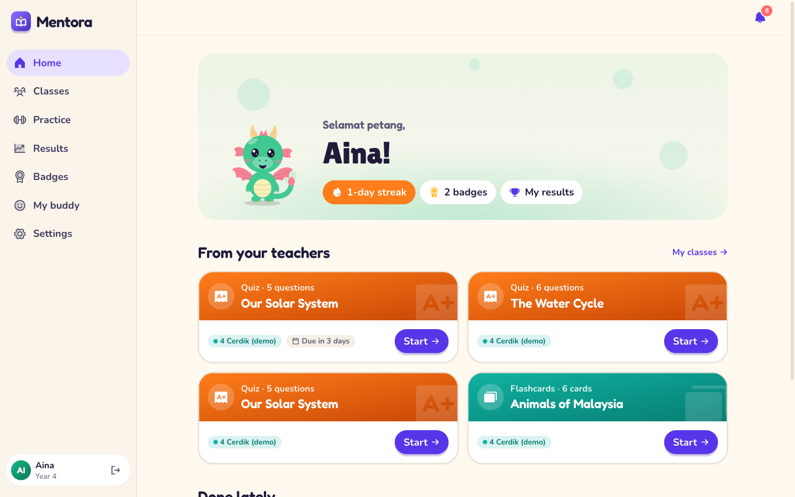

## For students

A playful, big-text view built for children: rounded display fonts, a text
size control everywhere they read, and animation that respects reduced motion.

**Three looks, picked from the student's year.**
- **Year 1–3** get bright bobbing tiles, a star path, confetti for every right
  answer, big playful words, and *Read it to me* in Astra's warm voice.
- **Year 4–6** play a quest: a map grid, a rocket riding the progress bar,
  points on each right answer and a rank at the end.
- **Form 1–5** get the clean, focused look.

Students practise what their teachers and family send, and what their buddy
makes from the bits they found tricky. They don't make sets themselves.

| | |
|---|---|
| 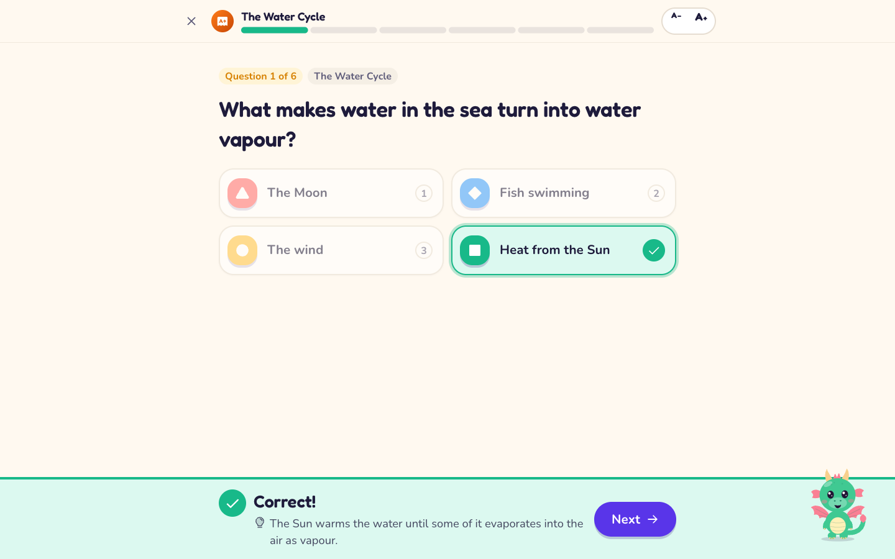 | 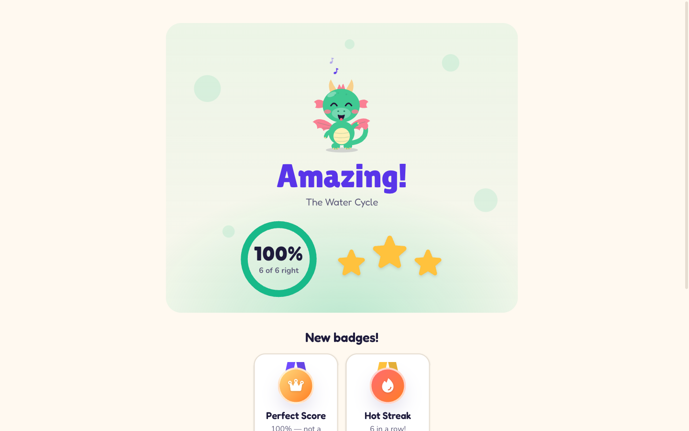 |
| **Quizzes, one question at a time.** Instant feedback with the reason, and a buddy who reacts. | **A finish worth celebrating.** Score, stars, badges earned, and how each skill went. |
| 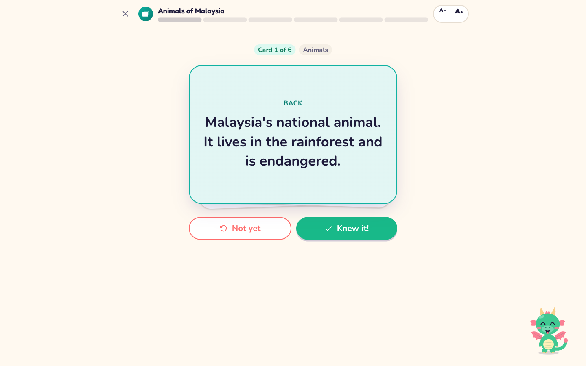 | 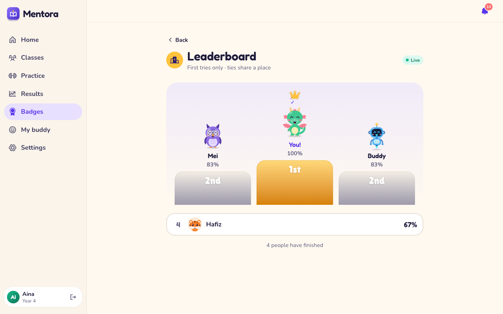 |
| **Flashcards that flip.** Cards you did not know come back for a second round. | **Live leaderboards** for every quiz — first tries only, ties share a place. |

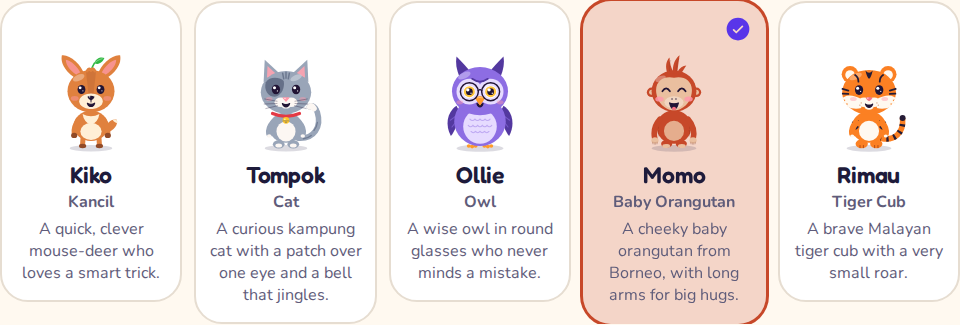

**Five study buddies** — Kiko, Tompok, Ollie, Momo and Rimau — each with their
own voice, moves, tricks and sounds (a babble in their own pitch under every
speech bubble). They greet, cheer right answers, comfort wrong ones, and
coach: halfway and last-one cheers, a nudge when a child is stuck, and a way
to think after two misses. The buddy goes with a student to **every page**,
knowing their progress, schedule, strengths and what needs practice, and
says the useful part: what is due, the skill to practise, a tip for doing
better at quizzes, flashcards, study guides and live lessons. **My results** is written for a child to read: the
buddy's one-line summary, recent scores, and skills sorted into *Got it*,
*Getting there* and *Let's practise*.

**A first-visit tour** for students, teachers and parents: a few animated
steps showing what each can do, easy to skip, and reopened from Settings.

| | |
|---|---|
| 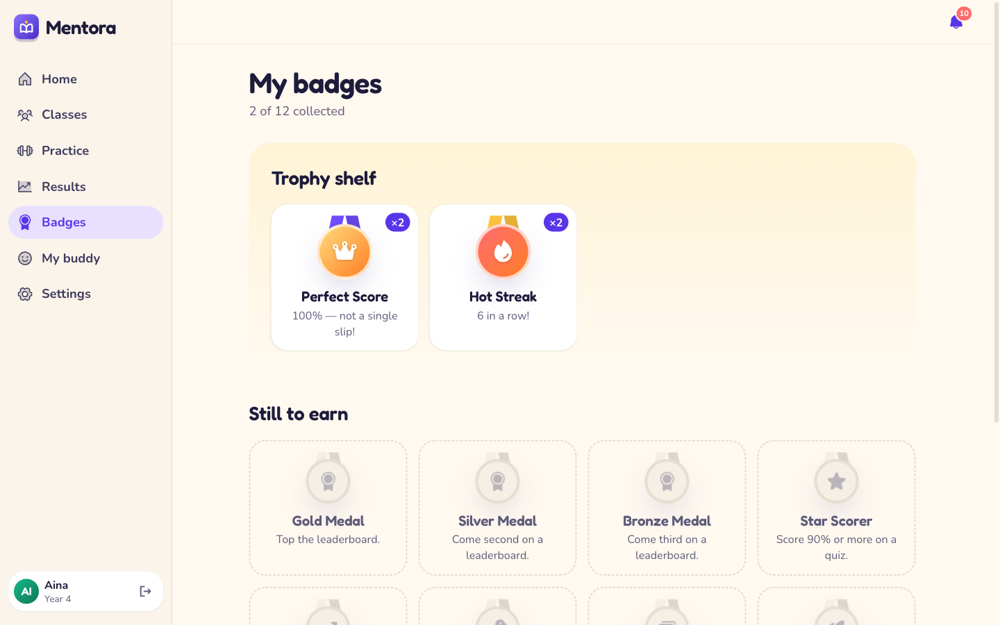 | 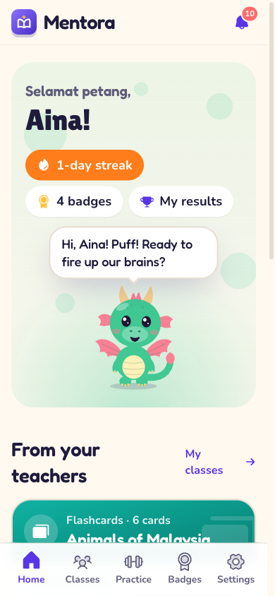 |
| **Badges** for perfect scores, streaks and leaderboard places. | **Made for phones and tablets**, where most students are. |

## Study guides

A topic taught part by part, from real sources, with a picture in every part.
Each part is written three times — **Simpler**, **Just right** and
**Challenge** — so a whole class reads the same lesson at a pace that fits
each child. Words to know open their meaning and their Malay, **Read it to me**
reads a part aloud with the sentence lighting up, and every part ends with a
quick check the teacher sees live.

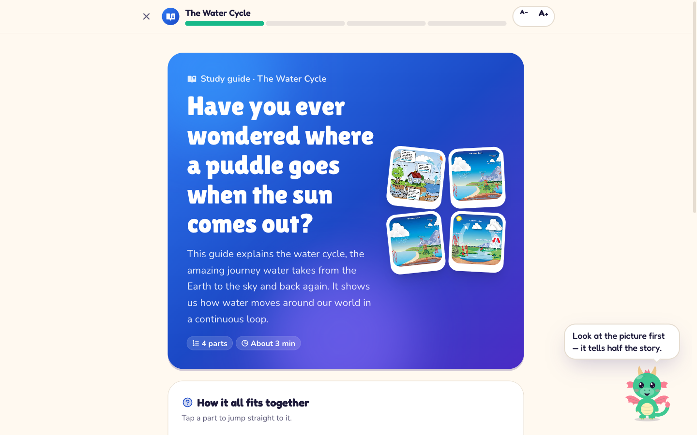

| | |
|---|---|
| 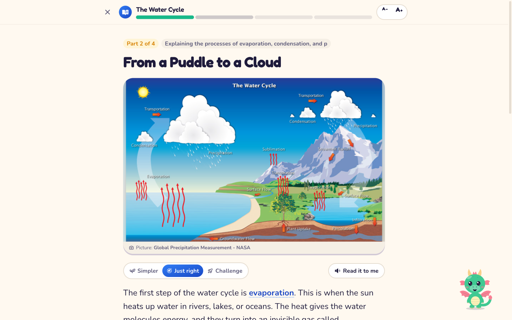 | 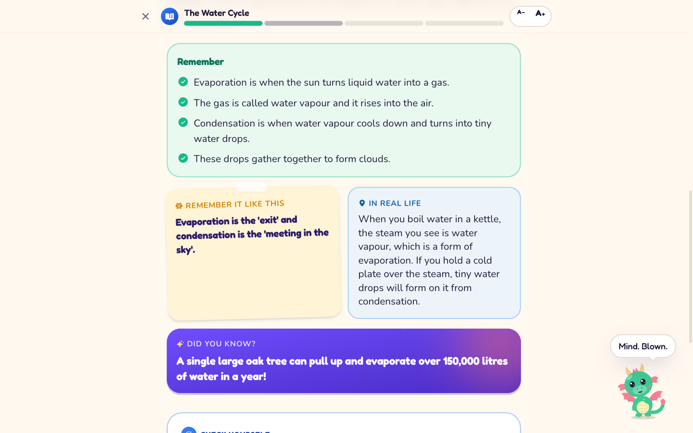 |
| **Pictures that teach** — whole diagrams, credited to their source, swappable by the teacher. | **What makes it stick** — key points, a memory trick, a Malaysian example, and a fact that makes the buddy's jaw drop. |

Teachers generate a guide in about a minute, edit any part, **rewrite a part
or add a new one with AI**, preview it as students will see it, and **print it
as a handout** with an answer key. See
[`docs/features/034-study-guides.md`](docs/features/034-study-guides.md).

## Live lessons

A teacher plans a lesson in four steps (who, what, how, after) and Mentora
writes it part by part. The teacher listens to every part in Astra's voice,
edits or rewrites what they want, and approves it. Then it goes on the
schedule of the whole class, or of the one group it is for.

- **Everyone hears the same sentence at the same time**, with the words
  lighting up, the key idea on screen and a star per part.
- **The lobby** opens ten minutes before. Each classmate floats in as their
  own buddy. Students never message each other.
- **Ask Astra, out loud or typed.** Questions queue in turn. Astra reads each
  one out, thanks the student by name and answers for the room.
- **The teacher's room** shows who is here, the question queue and the
  transcript as it is said. The teacher can pause, skip a part or end the
  lesson.
- **Afterwards**, the teacher gets a summary: attendance, every question and
  Astra's answer, the quick checks and the quiz average. Students get their
  notes. If the teacher chose one, a quiz made from the lesson is shared with
  the group.

See [`docs/features/037-live-lessons.md`](docs/features/037-live-lessons.md)
and [`docs/features/038-live-room.md`](docs/features/038-live-room.md).

## For teachers

| | |
|---|---|
| 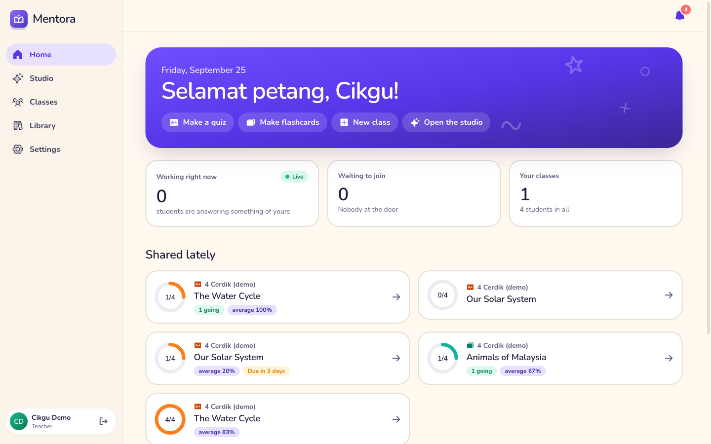 | 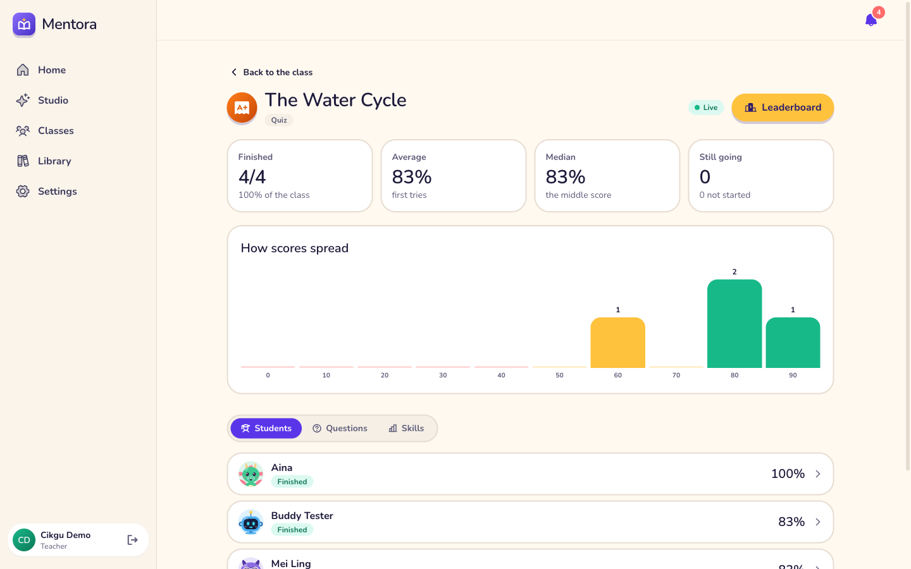 |
| **A home that shows the class at a glance** — who is answering right now, who is at the door, and how each shared set is going. | **Results as they happen.** Score spread, per-student drill-down, and which questions and skills need another look. |
| 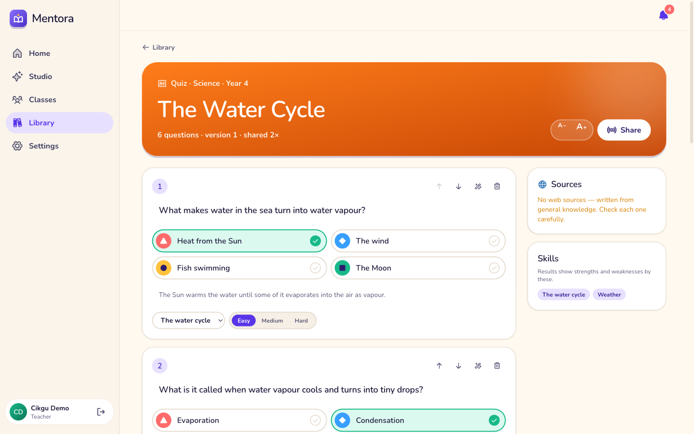 | 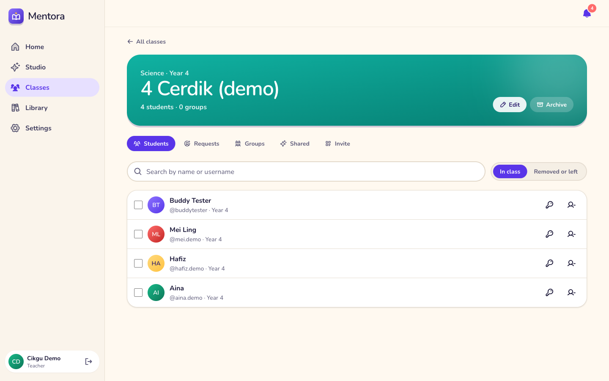 |
| **Generate, then edit.** Every question, answer, explanation, skill and difficulty is editable, and every set is versioned. | **Classes, groups and invites.** Students join with a link or a code; the teacher lets them in. |
| 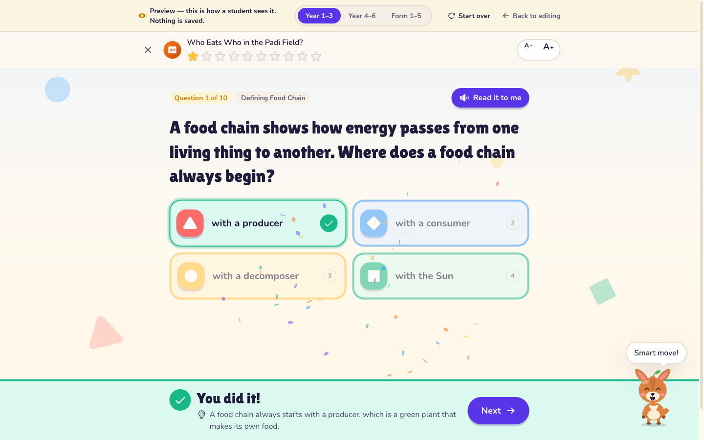 | 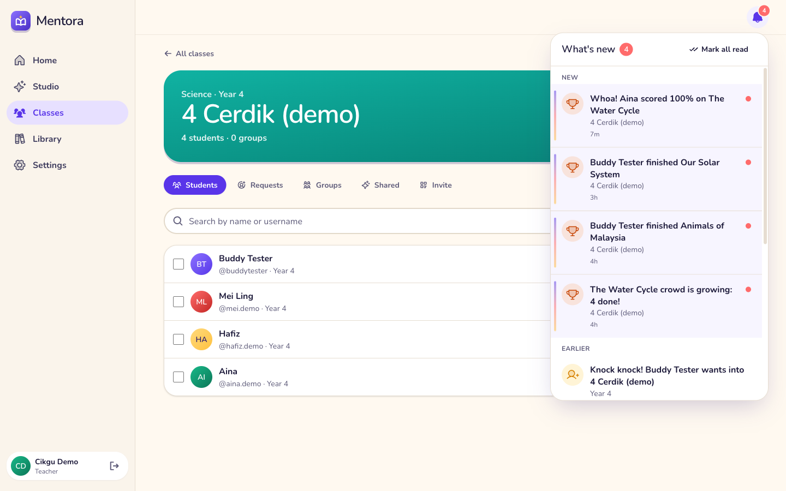 |
| **Preview as a student.** Play a quiz or flashcards before sharing, in the look its year gets. Nothing is saved. | **Live notifications** — join requests answerable in place, and news with a sense of fun. |

- **My materials.** Upload the worksheets, chapters and notes you teach from
  once (PDF, Word, PowerPoint or text), or **take a photo** of a page or the
  board. Make quizzes, flashcards, study guides and live lessons from them.
  Every item cites your file. The web fills gaps only if you ask it to.
- **The coverage map.** It shows how much of the year's syllabus each class
  has covered, month by month and topic by topic, with the class's score on
  each. It can draft the syllabus, suggest a plan for the rest of the year,
  and send a progress report home as a private link. Then it keeps nudging:
  the teacher sees the next topics to teach, and each student sees the class
  work they still have to finish.
- **Make it by asking.** In the chat, *"Make me a quiz on fractions for Year 4
  maths"* starts the quiz, and a card in the chat follows it until it's ready.
  It works out the subject from the topic, and asks only for what it cannot
  guess (usually the year).
- **Made for you.** When a student finds a shared quiz hard, Mentora makes
  them a short practice set on exactly the skills they missed.
- **Work in the background.** Making a set or recording a lesson carries on
  while you do something else. A tray beside the bell shows its progress,
  and the bell rings when it is ready.
- **Messages with families.** Write to the parents of any student in your
  classes, from **Messages** or the student list. Replies arrive live, and
  the envelope beside the bell counts what is waiting.

## For parents

A parent signs up on their own, or from the link their child sends from
**Settings → My family**. A parent who signed up alone connects by typing the
child's 6-letter code.

- **Linked to the child's teachers automatically.** The parent sees the
  child's classes, teachers and schedule. The teacher sees which students
  have a parent connected, and the two can message each other.
- **Only the parent can disconnect.** The child is told when a parent
  connects, and sees who is connected.
- **Everything the child does**, updated live as they work. Each child's
  page has six tabs: an overview of the week, all their work (past due
  first), results by skill, their practice, their live-lesson schedule, and
  each class with what it covers. Any finished quiz opens answer by answer.
- **Make something and send it home.** Parents make quizzes, flashcards and
  study guides from a topic or their own files. They send them to their
  child, with a due date if they like. The child finds them under *From
  home*, and the parent hears the score when it's done.
- **An instant alert when work goes past due**, whether a teacher or a
  parent set it. It arrives once, says where the work came from, and opens
  the child's work.
- **A chat of their own**, for helping at home: plain words, practical
  ideas, and it knows their children by name and year and what each is
  practising. It never shows a score or another child. There is no studio.
- **Messages with the teacher.** Write to each class's teacher about how the
  child is doing, homework, or anything to clarify. Replies arrive live
  ([`048`](docs/features/048-parent-teacher-messages.md)). The child never
  sees these messages.

See [`docs/features/042-parents.md`](docs/features/042-parents.md).

## Features

- **Four roles.** Admin, teacher, student and parent, each with its own
  signup, home and permissions — decided in one policy file and enforced by
  the API, not by hiding buttons.
- **Classes and groups.** Invite links and codes, join requests, groups, and
  work shared with a whole class or one group.
- **Grounded generation.** Quizzes, flashcards and study guides are written
  from the teacher's own files, sources the app searched and read, or both.
  Every answer is checked against them and the sources are shown. Malaysian
  Year and Form grades, in English, Malay, Tamil, Chinese or Bengali.
- **Live lessons with Astra.** Written, voiced and taught to a group on a
  schedule, with spoken questions answered by name. English only for now.
- **Study guides.** A topic taught part by part at three reading levels, with
  pictures, words to know in Malay, read-aloud, a concept map, a check after
  every part, and a printable handout.
- **Practice made for each student.** When a shared quiz is tricky, Mentora
  makes a short practice set on exactly the skills missed. Students practise;
  only teachers and parents make sets.
- **Three looks by year.** Quizzes and flashcards play differently for Year
  1–3, Year 4–6 and the Forms, picked from the student's year. Teachers and
  parents preview a set in its year's look. Year 1–3 get *Read it to me* in
  the tutor's voice.
- **Results and skills.** Per-student, per-question and per-skill results,
  a score spread, and a student's own strengths and next steps.
- **Coverage and reports home.** A syllabus map per class and private
  progress links for families.
- **Parent–teacher messages.** Live, one conversation per parent, teacher
  and child, closed the moment the link ends.
- **Real time everywhere.** Notifications, progress while a quiz is being
  taken, leaderboards, class lists and join requests update without a reload.
- **Study buddies, badges and streaks** to keep students coming back.
- **Guardrails for students.** A student in distress is answered with care
  and pointed to a trusted adult and Malaysian helplines; personal details are
  redacted; flagged moments go to a review queue. English and Malay.
- **Admin console.** Platform overview, user management, the safety queue and
  content oversight.
- **Accessible by default.** Text size from small to biggest, playful,
  classic or easy-read fonts, reduced motion, light and dark themes.

> **Students have no open chat for now, and don't make sets.** They take
> their class's work, work sent from home, and the practice made for them;
> every chat and set-making route refuses them.
>
> **The studio is switched off.** No one makes posters, slides, games,
> websites or apps, in the chat or anywhere else. Ones already made can still
> be opened, downloaded and shared. See
> [`docs/features/025-roles-and-signup.md`](docs/features/025-roles-and-signup.md).

## Quick start

Docker is the only prerequisite.

```bash
git clone https://github.com/khaled-saiful-islam/mentora.git && cd mentora
cp .env.example .env          # then set LLM_API_KEY
make up
```

Open <http://localhost:8300> and sign in with **admin / admin**.

`make up` builds the images, waits for Postgres, runs migrations, seeds the
admin account and starts everything. To try it with a class already full of
work, run `make demo` — it seeds a demo teacher, three students and shared
quizzes and flashcards, plus Aina's mum with work she sent home, and prints
their sign-ins.

| Container | Port | |
|---|---|---|
| `mentora-frontend` | `8300` | The web app (nginx, proxies `/api`) |
| `mentora-backend` | `8301` | FastAPI — docs at `/api/docs` |
| `mentora-db` | `8302` | PostgreSQL 16 |

`make dev` serves the frontend with hot reload on `8303`.

> **Change `SEED_ADMIN_PASSWORD` and `JWT_SECRET` before deploying anywhere.**
> The app refuses to start with the shipped defaults when `APP_ENV=production`.

## Production

Mentora is live at **https://mentora.stream**: one AWS Lightsail server in
Singapore running this same Compose stack, with Cloudflare in front for DNS
and HTTPS. On the server:

```bash
scripts/deploy.sh      # back up the database, pull main, rebuild, wait until healthy
scripts/backup-db.sh   # dump the database now (also runs nightly)
```

How it is set up, and why, is in
[`docs/features/049-production-deployment.md`](docs/features/049-production-deployment.md).

## Configuration

Everything is set in `.env`; [`.env.example`](.env.example) documents every
setting. The ones you are most likely to change:

| Setting | What it does |
|---|---|
| `LLM_BASE_URL`, `LLM_API_KEY`, `LLM_MODEL` | Any OpenAI-compatible model endpoint |
| `LEARNING_MODEL` | The model that writes quizzes and flashcards (empty uses `LLM_MODEL`) |
| `SERPAPI_KEY` | Web search, for grounded sets |
| `SPEECH_MODEL`, `SPEECH_VOICE`, `TRANSCRIBE_MODEL` | Astra's voice, and hearing students' spoken questions, in live lessons |
| `MATERIALS_PER_OWNER`, `MATERIAL_MAX_BYTES` | How many files a teacher or parent can keep in My materials, and how big each can be |
| `PARENT_SETS_PER_DAY` | How many quizzes, decks and guides a parent may make each day |
| `MODERATION_ENABLED` | The student guardrails |
| `PUBLIC_BASE_URL` | Where invite and share links point — set it for any real deployment |

## Commands

```
make up        build, migrate, seed, start, print the login
make demo      seed a demo class with work to try
make down      stop, keep the database
make dev       hot reload on both sides
make logs      follow logs
make test      backend pytest with coverage, then frontend vitest
make lint      ruff and tsc
make migrate   apply pending migrations
make reset     destroy the database and start clean
```

## How it is built

- **Backend:** FastAPI, Python 3.12, SQLAlchemy 2.0 async, Alembic, Pydantic v2,
  PostgreSQL 16. Logic never imports FastAPI, and a test enforces it.
- **Frontend:** React 18, TypeScript (strict), Vite, Tailwind v4 with theme
  tokens only, Motion for animation, Phosphor icons.
- **Extensible by design.** Model providers, tools, prompt sources, artifact
  kinds, learning kinds, badge rules, safety screens and domain-event
  reactions are each a protocol plus a registry: adding one is a new file and
  one registry line.
- **Live updates** go over one server-sent event stream per signed-in person.

[`CLAUDE.md`](CLAUDE.md) is the guide to working in the codebase, and
[`docs/features/`](docs/features) has one document per feature — what it does,
how it works, how to extend it and its known limits. [`PLAN.md`](PLAN.md) is
the roadmap.

## Tests

```bash
make test
```

About 1,900 backend tests against a real Postgres, rolled back per test,
and about 370 frontend tests.

## Credits

Forked from [Pelita](https://github.com/khaled-saiful-islam/pelita).

## Licence

MIT. See [LICENSE](LICENSE).
